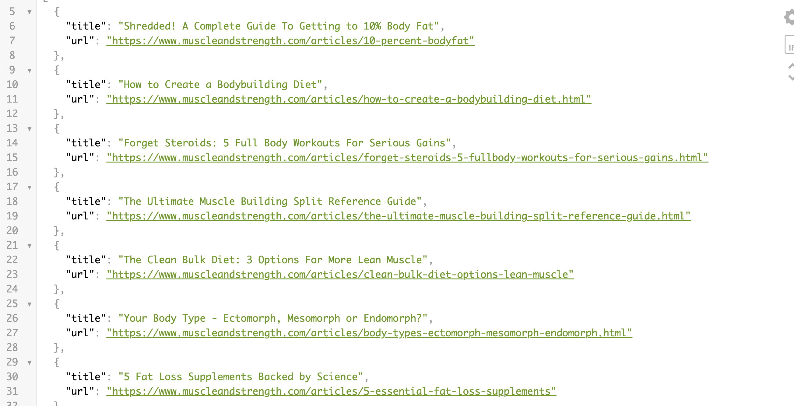

# flex-feasts

## Description
This application is designed for people looking to add healthy recipes to their gym routines! All you have to do is log in and the website will present both an energizing new exercise for you to try, as well as a nutritious recipe to create.

## Usage

## Links
https://flex-feasts.herokuapp.com/

## Credits 

Alexia Valenzuela https://github.com/alexiaValen
Josh Sandquist https://github.com/joshsandquist
Dior Goolsby https://github.com/negromcgee

https://www.muscleandstrength.com/workout-routines
https://www.muscleandstrength.com/articles
https://www.canva.com

## License

GNU GENERAL PUBLIC LICENSE
                       Version 3, 29 June 2007

 Copyright (C) 2007 Free Software Foundation, Inc. <https://fsf.org/>
 Everyone is permitted to copy and distribute verbatim copies
 of this license document, but changing it is not allowed.

                            Preamble

  The GNU General Public License is a free, copyleft license for
software and other kinds of works.